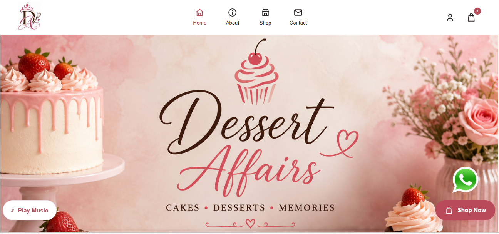

# 🍰 Dessert Affairs – Custom WordPress E-Commerce Website

**Live:** https://dessertaffairs.great-site.net/

**GitHub Repo:** https://github.com/blessing267/dessert-affairs

---

## 📖 About the Project

Dessert Affairs is a custom WordPress e-commerce website developed for a dessert business.

The website combines a custom-built WordPress theme with WooCommerce for online shopping functionality and Advanced Custom Fields (ACF) for editable website content.

Timber and Twig are used to organise the theme templates and separate presentation from WordPress logic, while SCSS is used to create maintainable and responsive styling.

Git and GitHub are used for version control, while GitHub Actions provides a CI/CD deployment workflow for automatically deploying theme changes from the repository to the production website.

The project was developed using a custom-theme workflow rather than relying on a pre-built WordPress theme or page builder. This provides greater control over the website's structure, styling and functionality while keeping content manageable through the WordPress admin area.

---

## 🛠️ Technologies Used

- **CMS:** WordPress
- **E-Commerce:** WooCommerce
- **Custom Fields:** Advanced Custom Fields (ACF)
- **Templating:** Timber / Twig
- **Backend / Theme Development:** PHP
- **Frontend:** HTML, CSS, JavaScript
- **Styling:** SCSS
- **Version Control:** Git & GitHub
- **CI/CD:** GitHub Actions
- **Deployment:** Automated deployment to production using GitHub Actions

---

## 📸 Screenshots

### 🏠 Homepage

 

### 🛍️ Shop Page

 

### 🍰 Product Page

 

### 🛒 Shopping Cart

 

### 💳 Checkout

---

## 🚀 Features

- 🎨 **Custom WordPress Theme** – Built from scratch rather than using a pre-built theme or page builder.

- 🛍️ **WooCommerce Integration** – Provides product management, product categories, shopping cart, checkout and order functionality.

- 🗂️ **Product Categories** – Customers can browse desserts by category from the shop interface.

- 🍰 **Product Pages** – Individual WooCommerce product pages display product images, prices, categories, quantity controls and purchasing options.

- 🛒 **Shopping Cart** – Customers can add products to their cart, adjust quantities, remove items and review order totals.

- 💳 **Checkout Experience** – WooCommerce provides the checkout workflow for completing customer orders.

- ⭐ **Product Reviews** – Customers can view and submit ratings and reviews for products.

- 📝 **Advanced Custom Fields (ACF)** – Business and marketing content can be managed through editable custom fields in WordPress.

- 🌿 **Timber / Twig Templates** – Theme templates use Timber and Twig to separate presentation from WordPress and PHP logic.

- 🎨 **SCSS Styling** – Styles are organised using SCSS for easier maintenance and responsive development.

- 📱 **Responsive Design** – The storefront is designed to adapt across desktop, tablet and mobile screen sizes.

- 🔧 **WordPress Admin Management** – Products, orders, website content and other store information can be managed through the WordPress dashboard.

- 🚀 **CI/CD Deployment Pipeline** – GitHub Actions is used to automate deployment of theme changes from the GitHub repository to the production website.

---

## 🏗️ Project Structure

The project separates responsibilities between WordPress, WooCommerce, ACF and the custom theme.

**WordPress** provides the content management system and administration interface.

**WooCommerce** manages e-commerce functionality including products, prices, categories, cart, checkout and orders.

**Advanced Custom Fields (ACF)** manages custom editable content such as hero sections, business information, catering content and other marketing sections.

**Timber / Twig** handles the presentation layer and template structure.

**SCSS** handles the website's visual design, reusable styles and responsive layouts.

This separation avoids duplicating functionality and makes the website easier to maintain and extend.

---

## 💻 Development Approach

Dessert Affairs was developed locally using LocalWP and a custom WordPress theme development workflow.

The project focuses on combining WordPress content management with custom development practices. Instead of placing all functionality directly inside templates, responsibilities are separated between WooCommerce, ACF, PHP and Timber/Twig.

This approach allows the business to manage products and website content through WordPress while maintaining a custom-designed frontend.

The workflow allows development and testing to take place locally before changes are committed, pushed to GitHub and deployed to the live environment.

---

## 🔗 Related Projects

- **Lily Beauty Bar:** https://github.com/blessing267/lilybeautybar
- **FarmMarket Web App:** https://github.com/blessing267/repo
- **AHU Web App:** https://github.com/blessing267/django-app